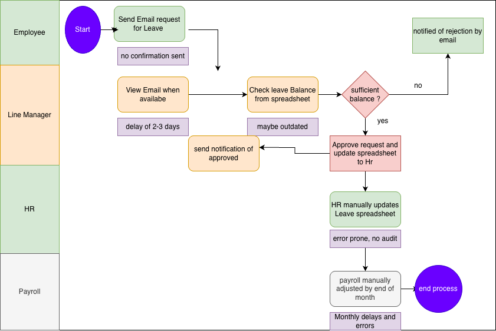
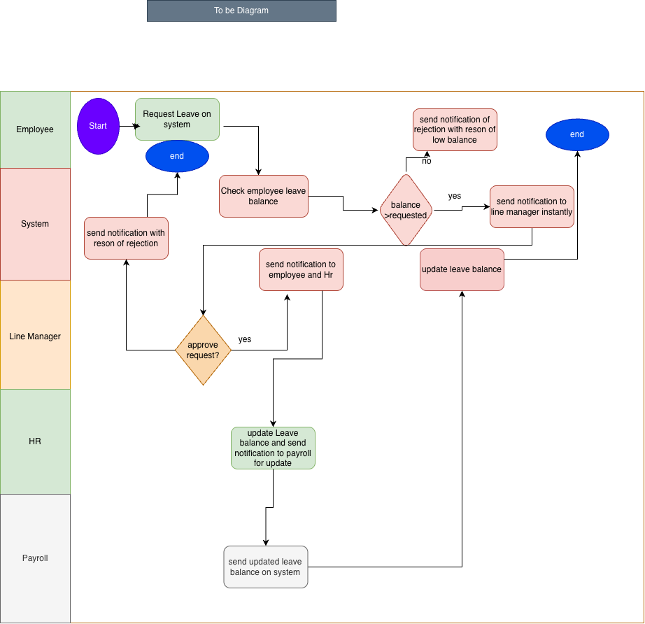

 
## About Me
 
I am a Business Systems Analyst with a background in Information Technology and Computer Engineering. My experience as an Android Developer and Data Analyst gives me a strong technical foundation — I understand how systems are built, how data flows, and how to communicate requirements clearly between business stakeholders and development teams.
 
This portfolio demonstrates my core BSA competencies through a structured series of real-world projects, each producing professional deliverables that a practising BSA would produce on the job.
 
**Core Skills:**
- Requirements Elicitation and Documentation
- Business Process Modelling (As-Is / To-Be)
- Gap Analysis and MoSCoW Prioritisation
- User Stories and Acceptance Criteria
- Stakeholder Management and Communication
- Business Requirements Documentation (BRD)
 
**Tools:** draw.io · Microsoft Word · Jira · Confluence · SQL · PowerBI · Tableau
 
---
 
## Project : Employee Leave Management System
 
### Business Problem
 
A mid-sized organisation was managing employee leave requests entirely through email and a shared HR spreadsheet. This manual process caused significant operational problems:
 
- Leave approval took **2 to 3 business days** due to manual email chains
- Managers had to check a shared spreadsheet manually to verify leave balances before responding
- Employees received no confirmation when submitting a request and had no visibility of their status
- Rejection emails contained no reason, leaving employees without explanation
- HR updated leave balances manually after each decision — a single point of failure with no backup
- Payroll was notified of leave changes by a separate manual email, causing frequent delays and errors
- There was no audit trail — disputes could not be resolved without searching through email histories
 
### My Role
 
I acted as the Business Systems Analyst for this project. I was responsible for analysing the current process, identifying gaps, engaging stakeholders, documenting requirements, and producing the full set of BSA deliverables that would guide the design and development of a replacement digital system.
 
### Solution Overview
 
The proposed Employee Leave Management System (ELMS) automates the entire leave request lifecycle — from digital submission through to payroll notification — using a centralised database, automated notifications, and role-based interfaces for employees, managers, HR, and payroll staff.
 
**Key improvements delivered by the system:**
- Leave requests submitted digitally with instant confirmation and a reference number
- Managers notified instantly and able to approve or reject through a dashboard interface
- Leave balance updated automatically within 60 seconds of approval
- Payroll notified automatically — no manual HR email required
- Rejection reason made mandatory before submission is permitted
- Full audit trail of all leave activity planned for Version 2
 
**Target outcome:** Approval time reduced from 2-3 days to same-day.
 
---
 
### Deliverables
 
| # | Deliverable | Description |
|---|-------------|-------------|
| D1 | Project Overview & Business Case | Defines the business problem, objectives, scope, stakeholders, and success criteria |
| D2 | Stakeholder Register | Identifies all stakeholders, their power/interest grid position, attitude, and engagement strategy |
| D3 | As-Is Process Map | Swimlane diagram of the current manual leave process with annotated pain points |
| D4 | Gap Analysis | Six documented gaps between the current and desired state with business impact and priority |
| D5 | User Stories & Acceptance Criteria | Six user stories covering all identified gaps, each with 3-4 acceptance criteria |
| D6 | To-Be Process Map | Swimlane diagram of the future automated process across five lanes |
| D7 | Business Requirements Document | Master BRD consolidating all deliverables into a single professional requirements baseline |
 
---
 
### Process Maps
 
**As-Is Process — Current Manual State**
 

 
**To-Be Process — Proposed Automated State**
 

 
---
 
### Gap Analysis Summary
 
| Gap ID | Area | Problem | Priority |
|--------|------|---------|----------|
| GAP-01 | Leave Submission | Email-based with no confirmation or tracking | Must Have |
| GAP-02 | Manager Notification | Manual email check causing 2-3 day delays | Must Have |
| GAP-03 | Leave Balance Update | Manual spreadsheet update — error-prone | Must Have |
| GAP-04 | Payroll Notification | Manual HR email to payroll — delays and omissions | Must Have |
| GAP-05 | Rejection Reason | No mandatory reason required on rejection | Must Have |
| GAP-06 | Audit Trail | No centralised record — compliance risk | Should Have — Version 2 |
 
---
 
### User Stories Summary
 
| Story | Actor | Summary |
|-------|-------|---------|
| US-01 | Employee | Submit leave request digitally with instant confirmation |
| US-02 | Line Manager | Receive instant notification and approve/reject with balance visibility |
| US-03 | HR Administrator | Leave balance updates automatically on approval |
| US-04 | Payroll Administrator | Automatic notification and payroll record update on approval |
| US-05 | Line Manager | Mandatory rejection reason required before submission |
| US-06 | HR Manager | Real-time audit trail with filtering and export — Version 2 |
 
---
 
### Tools Used
 
| Tool | Purpose |
|------|---------|
| draw.io | As-Is and To-Be swimlane process diagrams |
| Microsoft Word | BRD, stakeholder register, gap analysis, user stories |
| GitHub | Portfolio hosting and version control |
 
---
 
## Coming Soon
 
| Project | Domain | Focus |
|---------|--------|-------|
| Project 2 | E-Commerce Returns Management | Agile requirements, use case diagrams, data flow diagrams |
| Project 3 | Financial Reporting System | Complex stakeholder environments, traceability matrix, UAT planning |
 
---
 
## Contact
 
**Muhammad Hamza**  
Business Systems Analyst  
linkedin profile https://www.linkedin.com/in/muhammad-hamza-74035518a/
